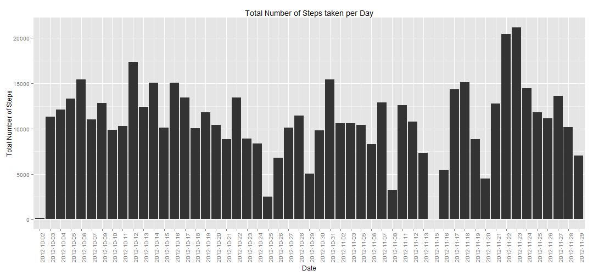
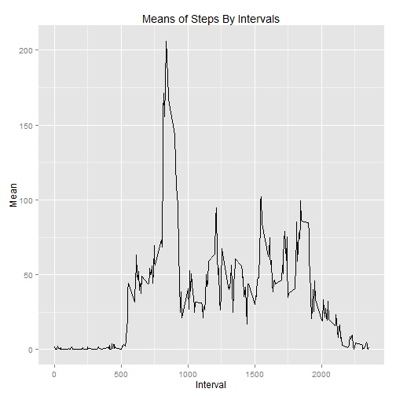
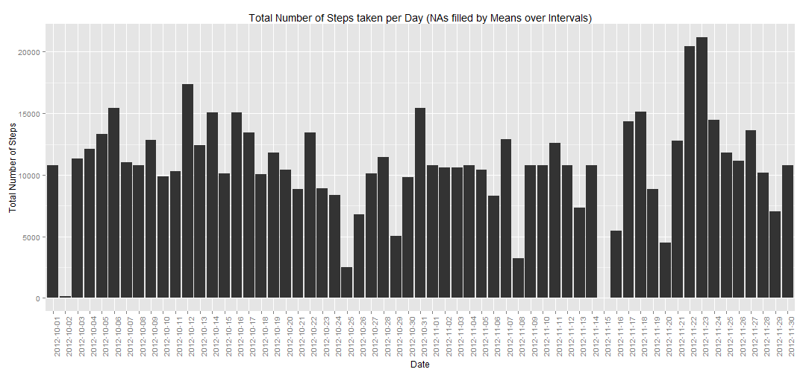
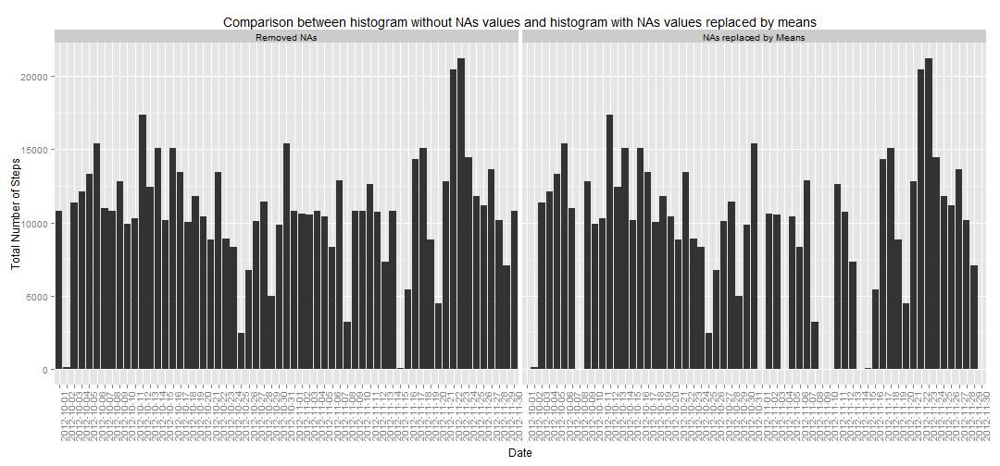
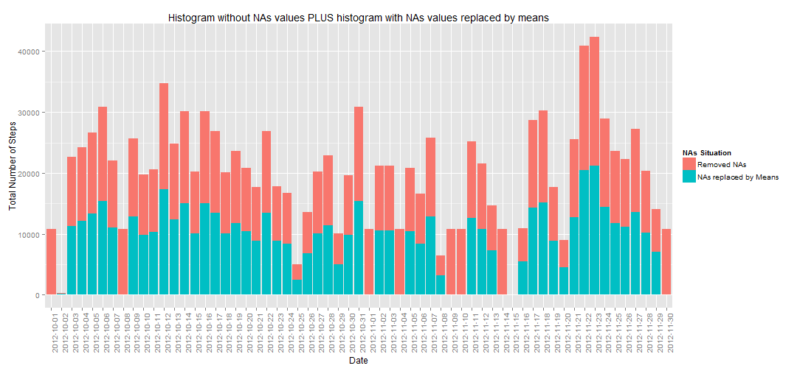
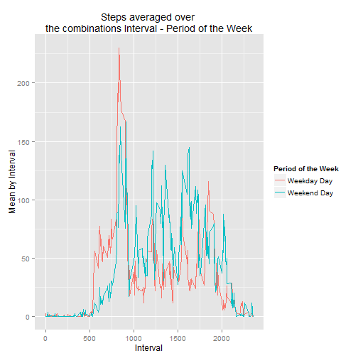

# Reproducible Research: Peer Assessment 1
For this assignment I found useful to import the following libraries, **ggplot2** for the graphs and **data.table** to better manipulate the data.

```r
  library(ggplot2)
  library(data.table)
```

## Loading and preprocessing the data
In order to load the data you need to unzip the file from the link:
https://d396qusza40orc.cloudfront.net/repdata%2Fdata%2Factivity.zip
and paying attention to, just in case, rename the unzipped file as **activity.csv**.

Read the file via the instruction

```r
df <- read.csv(file="activity.csv")
```
Pay attention that the file should be located in the working directory. Otherwise change the path in the above instruction.

## What is mean total number of steps taken per day?
For this part of the assignment, we can ignore the missing values in the dataset.


```r
dfNna <- df[!is.na(df[,"steps"]),]  
dt <- data.table(dfNna)
```

I chose to use data.table type of variable instead of the data.frame type, this is only to use some useful functionalities.

Now to make a histogram of the total number of steps taken each day we call the **qplot** function


```r
  qplot(x=dt$date, y=dt$steps, stat="identity", geom="histogram", main="Total Number of Steps taken per Day", xlab="Date", ylab="Total Number of Steps") + theme(axis.text.x = element_text(angle = 90, hjust = 1))
```

 

We also have to calculate and report the mean and median total number of steps taken per day 


```r
dt[, medianByDate:=median(steps), by=date]
dt[, meanByDate:=mean(steps), by=date]
```

```r
dt[, c("medianByDate","meanByDate"), with=FALSE]
```

```
##        medianByDate meanByDate
##     1:            0     0.4375
##     2:            0     0.4375
##     3:            0     0.4375
##     4:            0     0.4375
##     5:            0     0.4375
##    ---                        
## 15260:            0    24.4688
## 15261:            0    24.4688
## 15262:            0    24.4688
## 15263:            0    24.4688
## 15264:            0    24.4688
```

## What is the average daily activity pattern?
For this part of the assignment we simply have to make a time series plot of the 5-minute interval (x-axis) and the average number of steps taken, averaged across all days (y-axis).
In order to do this we have to create a new column in the data.table as the mean of the steps averaged across the single intervals


```r
dt[, meanByInterval:=mean(steps), by=interval]
```

The function now to call simply is the one defined in the **ggplot2** package


```r
ggplot(data=dt, aes(x=interval, y = meanByInterval)) + geom_line() + ggtitle("Means of Steps By Intervals") + xlab("Interval") + ylab("Mean")
```

 

As we can see from the graph the maximum value is near *interval = 800*, in order to retrieve the real value these are the commands used


```r
maximum <- dt[which(dt$meanByInterval == max(dt$meanByInterval)), ]
maximum[1,]$interval
```

```
## [1] 835
```

## Imputing missing values
For this part of the assignment the request is to fill the **NAs*** value we have in the column **"steps"** in the first dataframe


```r
df
```

We fill the **NA** spots with the means for the relatives 5-minute interval.


```r
dfSecond <- df
dtSecond <- data.table(dfSecond)
dtSecond[, meanByInterval:=mean(steps, na.rm=TRUE), by=interval]
dtSecond[, steps := {as.numeric(ifelse(is.na(steps), meanByInterval, steps))}]
```

As with the first part of the assignment here too we have to create the histogram


```r
qplot(x=dtSecond$date, y=dtSecond$steps, stat="identity", geom="histogram", main="Total Number of Steps taken per Day (NAs filled by Means over Intervals)", xlab="Date", ylab="Total Number of Steps") + theme(axis.text.x = element_text(angle = 90, hjust = 1))
```

 

and the relative **means** and **medians**


```r
dtSecond[, meanByDate:=mean(steps, na.rm=TRUE), by=date]
dtSecond[, medianByDate:=median(steps, na.rm=TRUE), by=date] 
```

```
##        meanByDate medianByDate
##     1:      37.38        34.11
##     2:      37.38        34.11
##     3:      37.38        34.11
##     4:      37.38        34.11
##     5:      37.38        34.11
##    ---                        
## 17564:      37.38        34.11
## 17565:      37.38        34.11
## 17566:      37.38        34.11
## 17567:      37.38        34.11
## 17568:      37.38        34.11
```

To have the comparison between these two datasets I define a new one the following way:

```r
dt[, cleanedByNA := "YES"]
dtSecond[, cleanedByNA := "NO"]
dtComp1 <- dt[, c("date", "steps","cleanedByNA"), with=FALSE]
dtComp2 <- dtSecond[,c("date", "steps","cleanedByNA"), with=FALSE]
dtComp <- dtComp1
dtComp <- rbind(dtComp, dtComp2)
```

And here the comparison:


```r
qplot(data=dtComp, x=date, y=steps, stat="identity", geom="histogram", main="Comparison between histogram without NAs values and histogram with NAs values replaced by means", xlab="Date", ylab="Total Number of Steps") + facet_grid(.~cleanedByNA, labeller=facets_labeller) + theme(axis.text.x = element_text(angle = 90, hjust = 1))
```

 

```r
qplot(data=dtComp, x=date, y=steps, stat="identity", geom="histogram", fill=cleanedByNA, main="Histogram without NAs values PLUS histogram with NAs values replaced by means", xlab="Date", ylab="Total Number of Steps") + theme(axis.text.x = element_text(angle = 90, hjust = 1)) + scale_fill_discrete(name  ="NAs Situation", labels=c("Removed NAs", "NAs replaced by Means"))
```

 

As we can see especially by the second graph is that in the process of filling the datasets with the means averaged by interval (**cleanedByNa = NO**) there are less void days (as we expected).

## Are there differences in activity patterns between weekdays and weekends?
For this part of the assignment is very important to create a new variable in the dataset with two levels – “weekday” and “weekend” indicating whether a given date is a weekday or weekend day
As my RStudio configuration is in Italian the word **"sabato"** means **"saturday"** and **"domenica"** means **"sunday"**:


```r
dtSecond$day <- weekdays(as.Date(dtSecond$date))
dtSecond[, weekPeriod := {ifelse(day == "sabato" | day == "domenica" , "weekend", "weekday")}]
```

We have to make a panel plot containing a time series plot of the 5-minute interval (x-axis) and the average number of steps taken, averaged across all weekday days or weekend days (y-axis). 
In order to achieve this goal we find the averaged number of steps for each couple of interval and period of the week ({50, weekday}, {50, weekend}, {55, weekday}, {55, weekend} etc. etc.)


```r
dtSecond[, meanByWeekPeriod:=mean(steps, na.rm=TRUE), by=list(interval,weekPeriod)]
```


```r
ggplot(data=dtSecond, aes(x=interval, y = meanByWeekPeriod, colour = weekPeriod)) + geom_line() + ggtitle("Steps averaged over \nthe combinations Interval - Period of the Week") + xlab("Interval") + ylab("Mean by Interval") + scale_colour_discrete(name  ="Period of the Week", labels=c("Weekday Day", "Weekend Day"))
```

 


